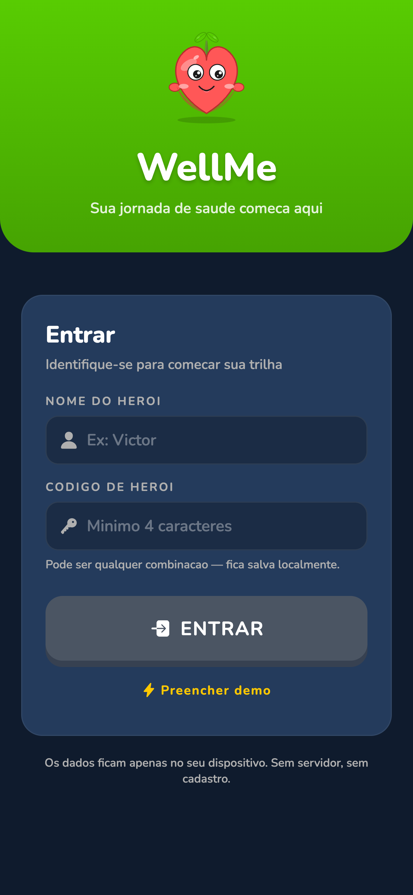
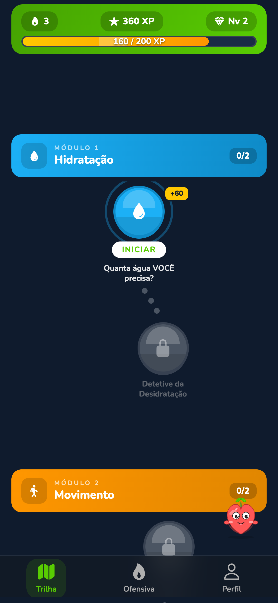
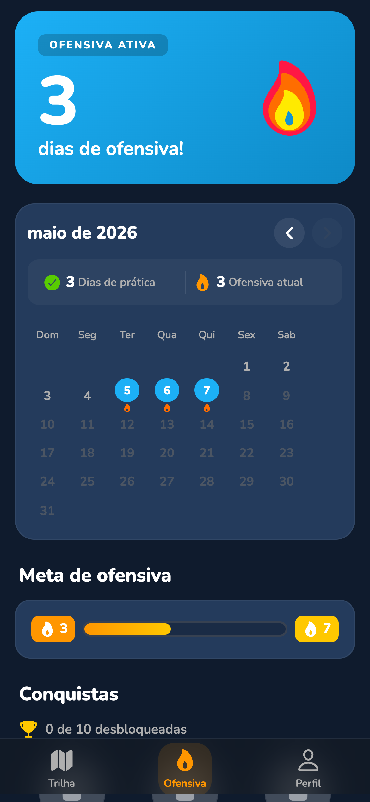
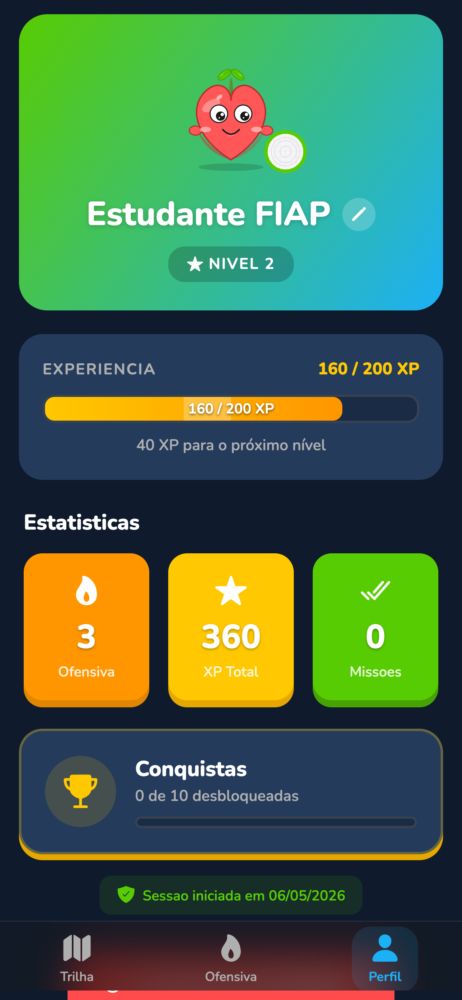

# WellMe

Aplicativo mobile gamificado de hábitos saudáveis, inspirado no Duolingo. O usuário avança por uma trilha de missões nos pilares de **hidratação, movimento, alimentação, mente, sono, prevenção e hábitos**, ganhando XP, subindo de nível, mantendo ofensivas (streaks) e desbloqueando conquistas.

> Projeto FIAP — Mobile com React Native + Expo + TypeScript.

**Demo web:** https://wellme-fiap.vercel.app

---

## Funcionalidades

- **Login mock** com validação de formulário (nome do herói + código)
- **Trilha gamificada** com 7 módulos de missões interativas
- **7 tipos de missão**: Quiz, Calculadora, Múltipla Escolha, Verdadeiro/Falso, Sequência cronometrada, Respiração guiada, Drag & Drop (montar prato)
- **Sistema de progressão**: XP, níveis, ofensiva diária e desbloqueio progressivo de missões
- **Calendário de prática** com marcação dos dias completados
- **Galeria de conquistas** com modais de detalhe
- **Persistência local** com AsyncStorage — progresso sobrevive entre sessões
- **Mascote Vita** com dicas rotativas e animações
- **Animações fluidas** com Reanimated v4 + Moti
- **Feedback háptico** em todas as interações
- **Suporte web** (PWA estática via react-native-web)

### ✨ Novidades da Sprint 4 (Mobile + IoT)

- **Arena ao Vivo** — ranking de heróis em **tempo real** via Socket.IO (presence "X online" + feed de eventos; a UI reordena sozinha). Cai em modo simulado se não houver servidor.
- **Movimento** — **pedômetro** (`expo-sensors`) conta passos reais que viram XP + **notificações locais** (`expo-notifications`) de hidratação/movimento, com permissões on-demand.
- **Segurança** — `heroCode` guardado no **SecureStore** (Keychain/Keystore); URLs em variáveis `EXPO_PUBLIC_*`; checklist `npm run check:secrets`.
- **UI/UX** — componentes `StateView` e `ConnectionBadge` padronizam os estados (vazio/loading/erro/sucesso) em todas as telas.
- **IoT** — não implementado (produto software-only); ver [docs/JUSTIFICATIVA_IOT.md](docs/JUSTIFICATIVA_IOT.md).

> Detalhes completos da Sprint 4 em **[docs/SPRINT4.md](docs/SPRINT4.md)**.

## Tecnologias

| Categoria | Stack |
|---|---|
| Core | Expo SDK 54, React Native 0.81, React 19, TypeScript (strict) |
| Navegação | expo-router 6 (file-based, Stack + Tabs) |
| Estado | React Context API + useReducer pattern + useMemo |
| Persistência | @react-native-async-storage/async-storage |
| Animação | react-native-reanimated v4, moti, lottie-react-native |
| UI | expo-linear-gradient, @expo/vector-icons (Ionicons), react-native-svg |
| UX | expo-haptics, react-native-gesture-handler |
| Tipografia | @expo-google-fonts/nunito |
| Web/Deploy | react-native-web, Vercel |

## Estrutura do projeto

```
.
├── app/                          # Rotas (expo-router file-based)
│   ├── _layout.tsx               # Layout raiz: fontes, splash, providers, auth gate
│   ├── login.tsx                 # Tela de login (mock auth)
│   ├── (tabs)/                   # Tabs autenticadas
│   │   ├── _layout.tsx
│   │   ├── index.tsx             # Trilha de missões
│   │   ├── conquistas.tsx        # Calendário + conquistas
│   │   └── perfil.tsx            # Perfil + estatísticas + logout
│   └── mission/[id].tsx          # Detalhe dinâmico de missão (modal)
├── src/
│   ├── components/               # UI reutilizável (Button3D, ProgressBar, ...)
│   │   └── missions/             # Componentes específicos por tipo de missão
│   ├── context/
│   │   └── GameContext.tsx       # Estado global do jogo + sessão
│   ├── data/
│   │   ├── types.ts              # Interfaces e enums (MissionStatus, etc.)
│   │   ├── initialData.ts        # Mock de missões e conquistas
│   │   └── storage.ts            # Wrappers AsyncStorage tipados
│   ├── theme/                    # colors, spacing, typography
│   └── constants/                # vitaTips, etc.
├── assets/                       # Ícones, splash, screenshots
├── app.json                      # Configuração Expo
├── tsconfig.json                 # TS strict + path aliases
└── vercel.json                   # Build config para deploy web
```

## Como rodar

### Pré-requisitos
- Node.js 18+
- npm ou yarn
- Expo Go (mobile) ou simulador iOS/Android

### Instalação

```bash
git clone <repo>
cd "Duolingo Saude"
npm install
```

### Execução

```bash
npm start          # abre o Metro bundler
# então pressione:
#   i  → iOS simulator
#   a  → Android emulator
#   w  → navegador web
```

Ou diretamente:
```bash
npm run ios        # iOS
npm run android    # Android
npm run web        # Web
```

### Build web (para deploy estático)

```bash
npx expo export -p web
# saída: ./dist/
```

## Fluxo de uso

1. **Login** — Informa nome e um "código de herói" (≥ 4 caracteres). Dados ficam em sessão local
2. **Trilha** — Toque numa missão disponível, leia a descrição no tooltip e clique em **COMEÇAR**
3. **Missão** — Resolva o desafio (quiz, calculadora, etc.). Ganhe XP ao concluir
4. **Progresso** — Veja XP/nível/ofensiva no header e no perfil
5. **Conquistas** — Calendário de dias praticados + galeria de badges
6. **Reset / Logout** — Disponível na aba Perfil

## Persistência

Toda a progressão fica em `AsyncStorage` (no web, localStorage). As chaves usadas:

- `@wellme:session:v1` — sessão do usuário (apenas `nome` + data de login)
- `@wellme:state:v1` — estado do jogo (XP, missões, conquistas, datas)

O **`heroCode` (credencial) NÃO fica em texto-puro**: a partir da Sprint 4 ele é
guardado no `expo-secure-store` (Keychain no iOS / Keystore no Android). No build web
não há keychain, então cai para AsyncStorage — nesse caso o `heroCode` é uma credencial
mock, não senha real (ver [docs/SPRINT4.md](docs/SPRINT4.md)).

Limpar dados do navegador / app zera o progresso.

## Variáveis de ambiente

Copie `.env.example` para `.env.local` (não versionado) e preencha. As variáveis
`EXPO_PUBLIC_*` são **públicas** (embutidas no bundle) — use só para URLs públicas:

- `EXPO_PUBLIC_REALTIME_URL` — URL do servidor Socket.IO (vazio = modo simulado)
- `EXPO_PUBLIC_REALTIME_MODE` — `auto` | `live` | `simulated`

Verifique que não há segredos no código com `npm run check:secrets`.

## Servidor de tempo real (Arena)

O ranking ao vivo usa um servidor Socket.IO em [`server/`](server/). Ele roda **separado**
do app (não entra no bundle), pois o Vercel serve apenas o front estático e não mantém
WebSocket persistente. Sem servidor configurado, a Arena entra em **modo simulado** (badge
"Simulado") — útil como fallback, mas que **não** demonstra eventos cliente↔servidor reais.

### Rodar localmente para a demonstração

Para mostrar o tempo real **de verdade** (exigido pela rubrica), basta rodar o servidor na
própria máquina — **não precisa de Railway nem deploy**:

```bash
# Terminal 1 — sobe o servidor Socket.IO
cd server
npm install
npm start                       # fica em http://localhost:3001  (GET /health p/ testar)

# Terminal 2 — sobe o app apontando para o servidor local
# crie um arquivo .env.local na raiz com a linha:
#   EXPO_PUBLIC_REALTIME_URL=http://localhost:3001
npx expo start -c               # -c limpa o cache do Metro
```

**Demonstração mais simples (2 abas no navegador, sem celular nem túnel):**

1. Abra o app web em **duas abas** — ambas conectam ao `localhost:3001`.
2. Aba 1: entre como "Ana" e abra a aba **Arena** → o badge deve ficar **"Ao vivo"** (verde), não "Simulado".
3. Aba 2: entre como "Téo" e **conclua uma missão**.
4. Na aba 1, o ranking **reordena sozinho** e o feed mostra "Téo ganhou +60 XP" — sem recarregar.

> No celular (Expo Go), use o IP da máquina na LAN (`http://192.168.x.x:3001`) em vez de
> `localhost`. Deploy opcional (Railway etc.) e contrato de eventos em
> [server/README.md](server/README.md).

## Screenshots

| Login | Trilha | Conquistas | Perfil |
|:---:|:---:|:---:|:---:|
|  |  |  |  |
| Tela de login com validação dos campos `nome` (min 2 chars) e `código` (min 4 chars) | Trilha gamificada com módulos, nodes interativos, XP e ofensiva no topo | Calendário de dias praticados + meta de ofensiva + galeria de conquistas | Avatar Vita, nível, XP detalhado, estatísticas e botão de sair |

## Deploy

O projeto está hospedado no Vercel como site estático (saída do `expo export -p web`):

- **Produção:** https://wellme-fiap.vercel.app

Configuração em [vercel.json](vercel.json) usa `npx expo export -p web` como build command e `dist/` como output.

## Equipe

| Nome | RM |
|---|---|
| Erick Molina | 553852 |
| Felipe Castro Salazar | 553464 |
| Marcelo Vieira de Melo | 552953 |
| Rayara Amaro Figueiredo | 552635 |
| Victor Rodrigues | 554158 |

## Licença

Projeto acadêmico — FIAP.
